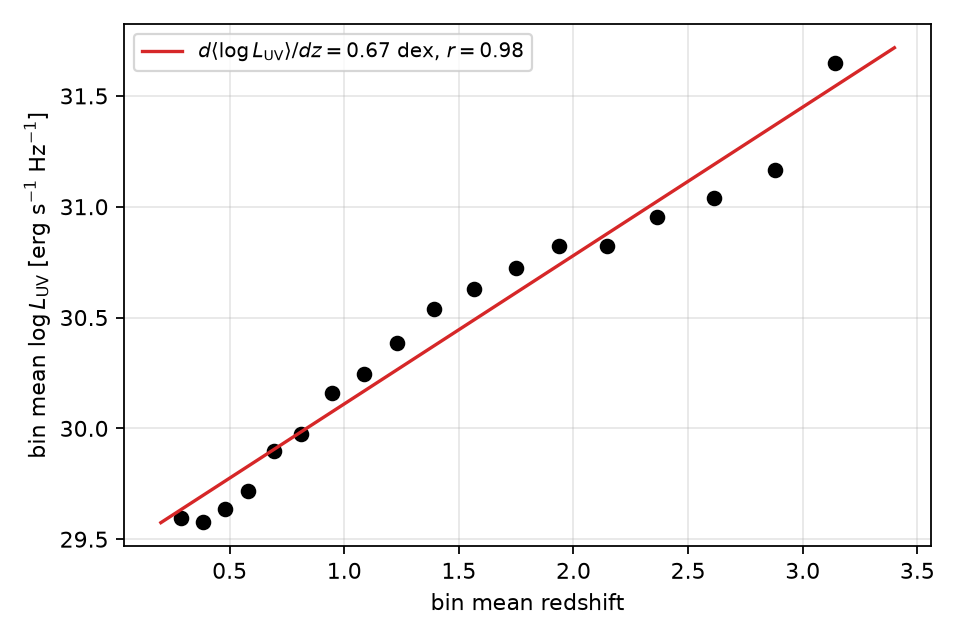
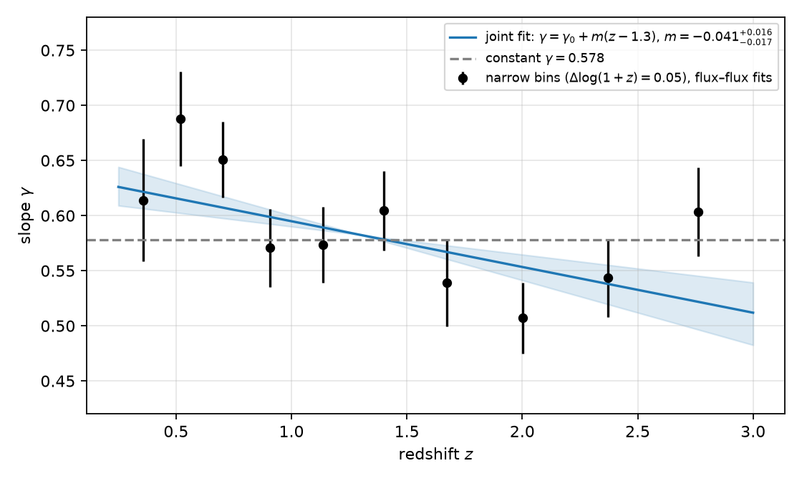
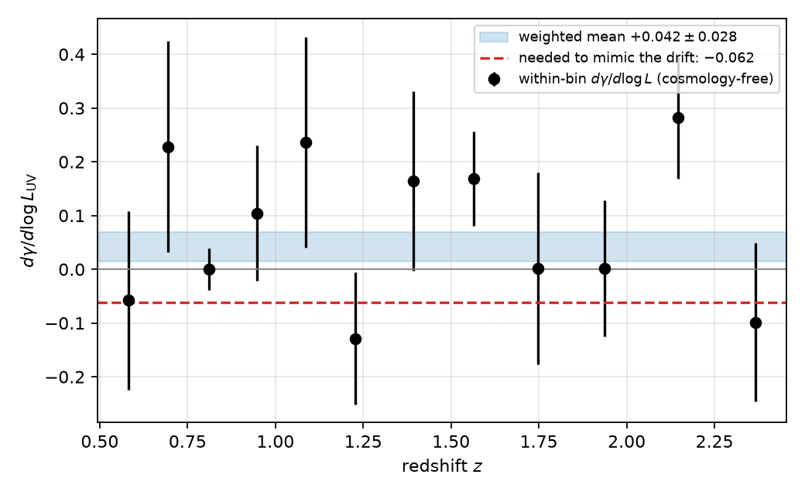
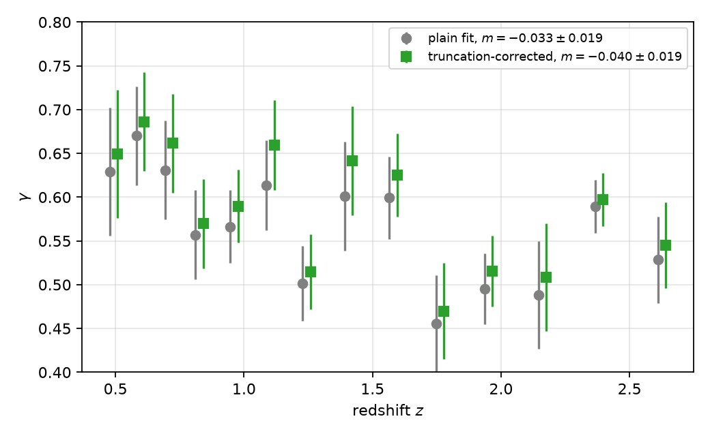
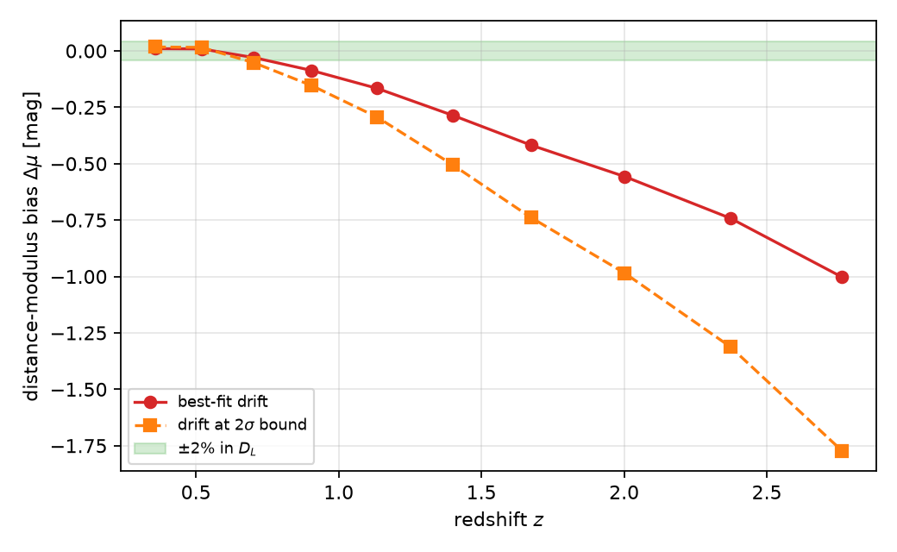

# Introduction

The non-linear relation between the ultraviolet and X-ray luminosities of quasars, $`\log L_{\mathrm{X}}=\gamma\log L_{\mathrm{UV}}+\beta`$ with $`\gamma\simeq0.6`$, has been known since the *Einstein* era and is understood as the imprint of the coupling between the accretion disc and the Comptonizing corona . Risaliti & Lusso (2015, 2019) and Lusso et al. (2020, hereafter L20) turned it into a distance indicator: if $`\gamma`$ and $`\beta`$ are universal, the observed fluxes of a quasar give its luminosity distance,
``` math
\begin{equation}
\log D_{\mathrm{L}}=\frac{\log F_{\mathrm{X}}-\gamma\log F_{\mathrm{UV}}-\beta'}{2(\gamma-1)},\qquad \beta'=\beta+(\gamma-1)\log4\pi ,
\label{eq:dl}
\end{equation}
```
and a Hubble diagram can be built out to $`z\simeq7`$, where Type Ia supernovae are unavailable. The stakes are the $`5\sigma`$ Hubble tension between the local ladder and the CMB ; see for a review.

The method has a single load-bearing assumption: $`\gamma`$ must not depend on redshift. The community tests this by fitting the relation in narrow redshift bins in flux–flux space, where the distance is approximately common to all objects in the bin and cosmology drops out, and checking that the bin slopes are flat. On this test the literature is split. L20, the eROSITA analysis of , and the new homogeneous sample of find a flat slope, $`\gamma\simeq0.58`$–$`0.60`$. find that the L20 compilation is not standardizable above $`z\simeq1.5`$–$`1.7`$; , and detect and correct a $`(1+z)^k`$ evolution of both luminosities with the Efron–Petrosian method; favour a copula-based redshift-evolutionary relation at $`>3\sigma`$; find a $`4\sigma`$ high/low-redshift inconsistency when the relation is calibrated on supernovae; find simultaneous dependence on redshift and X-ray photon index; and find that even the intrinsic scatter is redshift dependent above $`z\simeq1.6`$. argue on general grounds that a luminosity–luminosity correlation cannot by itself fix the distance–redshift relation, and concede deviations from $`\Lambda`$CDM above $`z\simeq1.5`$ while excluding severe systematics in the data.

This paper does not take a side. It makes three narrower points on the public L20 catalogue.

1.  In a flux-limited sample redshift and luminosity are collinear, so “$`\gamma(z)`$ is flat” and “$`\gamma(L_{\mathrm{UV}})`$ is flat” are the same statement to the binned test. We quantify the collinearity and show which additional, cosmology-free measurement breaks it (Section <a href="#sec:degeneracy" data-reference-type="ref" data-reference="sec:degeneracy">3</a>).

2.  We measure the redshift drift of $`\gamma`$ with a binning-free joint likelihood and then attack it with every non-cosmological explanation we can test on the catalogue itself (Sections <a href="#sec:joint" data-reference-type="ref" data-reference="sec:joint">4</a>–<a href="#sec:doubt" data-reference-type="ref" data-reference="sec:doubt">5</a>).

3.  We convert the allowed drift into the distance error it produces and into the precision on $`m=d\gamma/dz`$ that a percent-level $`H_0`$ from quasars alone would require (Section <a href="#sec:cost" data-reference-type="ref" data-reference="sec:cost">6</a>).

An earlier draft by one of us (N. A. S., 2026, unpublished) reported $`m=-0.002\pm0.007`$ on this catalogue. That value does not reproduce and the present analysis supersedes it; the audit is in the companion folder of our repository.

# Data

We use table 3 of L20 exactly as distributed by CDS/VizieR (`J/A+A/642/A150`): 2421 quasars with rest-frame $`2500`$ Å and 2 keV monochromatic fluxes, their errors, the X-ray photon index $`\Gamma_{\mathrm{X}}`$, and a group flag identifying the sub-sample each object comes from. Redshifts span $`0.009\le z\le7.54`$ with median 1.30. L20 already removed broad-absorption-line and radio-loud objects, dust-reddened sources ($`E(B-V)>0.1`$), X-ray absorbed sources ($`\Gamma_{\mathrm{X}}`$ outside 1.7–2.8) and objects liable to Eddington bias. We apply no further cut. Group 5, the SDSS-DR14Q $`\times`$ 4XMM-DR9 cross-match, holds 1644 objects; group 6 (608) is the Chandra sample; groups 1–4 and 7 (169 objects) are small local and high-redshift additions. Luminosities are used only (a) to define the luminosity axis of Fig. <a href="#fig:coll" data-reference-type="ref" data-reference="fig:coll">1</a>, (b) for the full-sample curvature test of Section <a href="#sec:curv" data-reference-type="ref" data-reference="sec:curv">5.1</a>, and (c) to define the anchor in Section <a href="#sec:cost" data-reference-type="ref" data-reference="sec:cost">6</a>; for these we adopt a flat $`\Lambda`$CDM with $`H_0=70`$ km s$`^{-1}`$ Mpc$`^{-1}`$ and $`\Omega_m=0.315`$ and verify insensitivity to $`\Omega_m\in[0.25,0.40]`$. The full-sample luminosity-space fit reproduces the well-known values $`\gamma=0.664\pm0.007`$, $`\beta=6.33\pm0.22`$, $`\delta=0.230\pm0.004`$ dex; we do not use them further because they are the cosmology-dependent quantities the flux–flux method is designed to avoid.

# The redshift–luminosity degeneracy

We divide the sample into shells of width $`\Delta\log(1+z)=0.03`$ and keep the 18 shells with at least 25 objects (2336 quasars, $`0.29\le\langle z\rangle\le3.14`$). Figure <a href="#fig:coll" data-reference-type="ref" data-reference="fig:coll">1</a> shows the shell-mean $`\log L_{\mathrm{UV}}`$ against the shell-mean redshift: the two are collinear with correlation coefficient $`r=0.982`$ and slope $`0.67`$ dex per unit redshift. Any smooth dependence of the slope on redshift, $`\gamma=\gamma_0+m\,(z-1.3)`$, is therefore observationally equivalent to a dependence on luminosity, $`\gamma=\gamma_0+\kappa\,(\langle\log L_{\mathrm{UV}}\rangle-30)`$, with $`\kappa\simeq m/0.67`$.

<figure id="fig:coll">

<figcaption>Shell-mean UV luminosity against shell-mean redshift for the 18 narrow shells. The collinearity (<span class="math inline"><em>r</em> = 0.98</span>) is a property of any flux-limited sample and is what makes “<span class="math inline"><em>γ</em></span> is flat in <span class="math inline"><em>z</em></span>” and “<span class="math inline"><em>γ</em></span> is flat in <span class="math inline"><em>L</em><sub>UV</sub></span>” indistinguishable to a binned test.</figcaption>
</figure>

We make this explicit with a joint likelihood. For quasar $`i`$ in shell $`s(i)`$ let $`u_i=\log F_{\mathrm{UV},i}-\tilde x_{s(i)}`$ be the UV flux offset from the median of its own shell. We model
``` math
\begin{equation}
\log F_{\mathrm{X},i}=\gamma_i\,u_i+\beta_{s(i)},\qquad
\gamma_i=\begin{cases}\gamma_0 & \text{(C)}\\ \gamma_0+m\,(z_i-1.3) & \text{(Z)}\\ \gamma_0+\kappa\,(\langle\log L_{\mathrm{UV}}\rangle_{s(i)}-30) & \text{(L)}\end{cases}
\end{equation}
```
with one free intercept $`\beta_s`$ per shell, which absorbs the (unknown) luminosity distance of that shell, and a single intrinsic scatter $`\delta`$. The likelihood is that of , with variance $`\delta^2+\sigma_{y,i}^2+\gamma_i^2\sigma_{x,i}^2`$. Model C has $`2+18`$ parameters, models Z and L have $`3+18`$. No cosmology enters models C and Z at all; model L uses the fiducial cosmology only to order the shells along the luminosity axis.

Table <a href="#tab:models" data-reference-type="ref" data-reference="tab:models">1</a> gives the result. Models Z and L are indistinguishable ($`\Delta{\mathrm{AIC}}=1.1`$). Both improve on the constant slope by $`2\Delta\ln\mathcal L=7.3`$ ($`p=0.007`$ for one extra parameter); the BIC, with its stronger penalty, prefers the constant slope by 0.4. The evidence for any drift is thus moderate, and the evidence for its being a *redshift* drift rather than a *luminosity* drift is nil, as it must be given Fig. <a href="#fig:coll" data-reference-type="ref" data-reference="fig:coll">1</a>.

<div id="tab:models">

| Model | $`\gamma_0`$ | slope param. | $`\delta`$ | AIC | BIC |
|:---|:--:|:--:|:--:|:--:|:--:|
| C: constant | 0.578 | — | 0.224 | $`-147.96`$ | $`-32.84`$ |
| Z: $`\gamma(z)`$ | 0.583 | $`m=-0.044`$ | 0.224 | $`-153.28`$ | $`-32.40`$ |
| L: $`\gamma(L_{\mathrm{UV}})`$ | 0.608 | $`\kappa=-0.069`$ | 0.224 | $`-154.34`$ | $`-33.46`$ |

Joint flux–flux fits with 18 shell intercepts (2336 quasars). $`\gamma_0`$ is the slope at $`z=1.3`$ (models C, Z) or at $`\log L_{\mathrm{UV}}=30`$ (model L).

</div>

# The drift and its uncertainty

Sampling model Z with <span class="smallcaps">emcee</span> (46 walkers, 4000 steps, 1500 discarded; the 18 intercepts marginalised) gives
``` math
\begin{equation}
\gamma_0(z{=}1.3)=0.582\pm0.011,\quad m=-0.042^{+0.016}_{-0.017},\quad \delta=0.225\,{\mathrm{dex}},
\end{equation}
```
with $`P(m\ge0)=0.3\%`$ and a 95% bound $`|m|<0.070`$. A rerun with a different random seed gives $`m=-0.046\pm0.017`$. Figure <a href="#fig:gz" data-reference-type="ref" data-reference="fig:gz">2</a> shows the per-shell slopes (plain fits, bootstrap errors) with the joint fit overlaid. The per-shell errors are 0.03–0.05 for 150–330 objects, so any four-bin estimate of $`m`$ on this catalogue has $`\sigma_m\gtrsim0.013`$; claims of $`\sigma_m<0.01`$ from these data are not achievable.

<figure id="fig:gz">

<figcaption>Slope <span class="math inline"><em>γ</em></span> in narrow flux–flux shells (<span class="math inline"><em>Δ</em>log (1 + <em>z</em>) = 0.05</span> here for legibility; the joint fit uses 0.03). Blue: model Z with its 68% band. Grey: the constant-slope fit. The drift is carried by the shells below <span class="math inline"><em>z</em> ≃ 0.7</span>.</figcaption>
</figure>

The drift’s *sign* is stable against the shell width: for $`\Delta\log(1+z)=0.03, 0.04, 0.05, 0.07, 0.10`$ the binned estimates are $`m=-0.056, -0.036, -0.043, -0.070, -0.065`$ with errors 0.015–0.019. Its *significance* is not: the $`\chi^2`$ of a constant slope has $`p`$ between 0.026 and $`<0.001`$ depending on the binning, which is why we quote the binning-free value above.

# Doubting the drift

We now try to remove the drift with every non-cosmological mechanism the catalogue lets us test. Table <a href="#tab:robust" data-reference-type="ref" data-reference="tab:robust">2</a> summarises.

## Luminosity curvature

If the true relation is curved, $`\log L_{\mathrm{X}}=\gamma_0 u+q u^2+\beta`$, the local slope is $`d\gamma/d\log L_{\mathrm{UV}}=2q`$ and the drift in Table <a href="#tab:models" data-reference-type="ref" data-reference="tab:models">1</a> would be a luminosity effect masquerading as evolution. Model L requires $`\kappa=m/0.67=-0.062`$. The curvature can be measured *within* each shell, cosmology-free, because inside a shell luminosity and flux differ by a constant. Fitting the quadratic in the 12 shells with $`N\ge100`$ (bootstrap errors) gives a weighted $`q=+0.021\pm0.014`$, i.e. $`2q=+0.042\pm0.028`$ (Fig. <a href="#fig:curv" data-reference-type="ref" data-reference="fig:curv">3</a>): the wrong sign, and $`3.7\sigma`$ from the value required. The full-sample luminosity-space quadratic, which does depend on cosmology, gives $`q=-0.008\pm0.007`$ for $`\Omega_m=0.25, 0.315, 0.40`$, also inconsistent with $`q=-0.031`$. Luminosity curvature does not explain the drift. (Flux-limit truncation flattens the faint end and would bias $`q`$ positive; this makes the test conservative in the direction of rejecting curvature, but a truncation-aware curvature fit is beyond the present data.)

<figure id="fig:curv">

<figcaption>Within-shell slope curvature <span class="math inline"><em>d</em><em>γ</em>/<em>d</em>log <em>L</em><sub>UV</sub> = 2<em>q</em></span> (cosmology-free), its weighted mean (band), and the value a luminosity-dependent slope would need in order to mimic the observed redshift drift (dashed).</figcaption>
</figure>

## Flux-limit truncation

At high redshift only the X-ray brightest objects at a given UV flux survive the detection limit; this cuts the faint end of the dependent variable and flattens the slope, mimicking a negative $`m`$ . In the catalogue, 22% of the lowest shell and 13–26% of the two highest shells lie within 0.3 dex of the shell’s faintest X-ray flux, so the limit does bite at both ends. We refit each shell with a truncated-Gaussian likelihood, $`p(y\,|\,x,\,y>y_{\mathrm{lim}})=\mathcal N(y;\mu,s)/[1-\Phi((y_{\mathrm{lim}}-\mu)/s)]`$, taking $`y_{\mathrm{lim}}`$ at the 0th, 1st or 3rd percentile of the shell’s $`\log F_{\mathrm{X}}`$. The correction raises the individual slopes by $`+0.007`$, $`+0.022`$, $`+0.043`$ on average for the three floors, but the fitted drift is unchanged: $`m=-0.056, -0.040, -0.059`$ versus $`-0.053, -0.033, -0.047`$ uncorrected, all $`\pm0.02`$ (Fig. <a href="#fig:trunc" data-reference-type="ref" data-reference="fig:trunc">4</a>). A sharp floor is a crude model of the SDSS $`\times`$ XMM selection, so this excludes only the simplest form of truncation bias; a forward model of the survey selection function remains the definitive test.

<figure id="fig:trunc">

<figcaption>Per-shell slopes with a plain likelihood (grey) and a truncated-Gaussian likelihood with the floor at the shell’s 1st percentile in <span class="math inline">log <em>F</em><sub>X</sub></span> (green, offset in <span class="math inline"><em>z</em></span> for clarity). The correction shifts the slopes up but not the drift.</figcaption>
</figure>

## X-ray photon index

Both $`\Gamma_{\mathrm{X}}`$ and redshift are available per object. $`\Gamma_{\mathrm{X}}`$ correlates weakly with redshift (Spearman $`\rho=0.14`$, $`p=10^{-12}`$) and, within shells, hardly at all with UV flux ($`\langle r\rangle=-0.05`$). Adding a term $`c\,(\Gamma_{\mathrm{X}}-2.175)`$ to model Z gives $`c=-0.33\pm0.02`$ dex per unit photon index and lowers $`\delta`$ from 0.224 to 0.211 dex, while $`m=-0.063\pm0.015`$ stays negative. We do not interpret $`c`$ physically: the rest-frame 2 keV flux in L20 is derived from band fluxes using $`\Gamma_{\mathrm{X}}`$, so part of $`c`$ is methodological. Splitting the sample at the median $`\Gamma_{\mathrm{X}}`$ gives $`m=-0.052\pm0.021`$ (soft half) and $`-0.065\pm0.022`$ (hard half). The photon-index mix does not create the drift; see for a fuller treatment.

## Within-shell distance variation

Even in a shell of $`\Delta\log(1+z)=0.03`$ the luminosity distance varies, coherently moving objects along a slope-1 line and biasing $`\gamma`$ towards unity, most strongly at low redshift. The standard deviation of $`2\log D_{\mathrm{L}}`$ within a shell falls from 0.095 dex at $`\langle z\rangle=0.29`$ to 0.03 dex at $`z>1.9`$. We remove the effect by rescaling each object’s fluxes to the shell-median distance, $`F'=F\,(D_{\mathrm{L}}(z)/D_{\mathrm{L}}(z_{\mathrm{shell}}))^2`$, which uses only the shape of $`D_{\mathrm{L}}(z)`$ inside the shell ($`H_0`$ cancels). The result is $`m=-0.046\pm0.016`$, $`-0.043\pm0.016`$, $`-0.043\pm0.016`$ for $`\Omega_m=0.315, 0.25, 0.40`$, against $`-0.046\pm0.017`$ undetrended. The effect is real in principle but too small to matter here.

## Sample heterogeneity and redshift range

The homogeneous group 5 (SDSS $`\times`$ 4XMM, 1619 objects in the shells) gives $`m=-0.060\pm0.021`$, $`P(m\ge0)=0.2\%`$; groups 5+6 give $`-0.041\pm0.017`$. Heterogeneity does not create the drift either.

What does matter is the redshift range. Restricting to $`z>0.7`$, the range of the new homogeneous sample of , gives $`m=-0.022\pm0.019`$ ($`P(m\ge0)=13\%`$), fully consistent with zero and with their $`\gamma=0.58\pm0.01`$; group 5 above $`z=0.7`$ gives $`-0.049\pm0.027`$. The shells below $`z=0.7`$ alone (364 objects) cannot constrain a slope ($`\gamma_0=0.85\pm0.18`$) but have individually high slopes, 0.61–0.69. The drift in the L20 compilation is therefore a statement about the contrast between $`z<0.7`$ and $`z>0.7`$, not a smooth trend across $`0.7<z<3`$. This reconciles, at least on this catalogue, the “no evolution” results of L20, and , all of which start at or above $`z\simeq0.7`$ or concern eROSITA depths, with the high/low-redshift inconsistencies of and , whose low-redshift anchors reach down to $`z\simeq0.1`$. We cannot say from these data whether the low-redshift excess in $`\gamma`$ is astrophysical (host-galaxy light at 2500 Å would raise $`F_{\mathrm{UV}}`$ preferentially for faint, low-$`z`$ objects and steepen the apparent slope), a residual of the L20 selection, or the start of a genuine trend.

<div id="tab:robust">

| Variant | $`N`$ | $`m`$ |
|:---|:--:|:--:|
| Baseline, model Z | 2336 | $`-0.042^{+0.016}_{-0.017}`$ |
| Rerun, different seed | 2336 | $`-0.046\pm0.017`$ |
| Detrended to shell-centre $`D_{\mathrm{L}}`$ ($`\Omega_m=0.315`$) | 2336 | $`-0.046\pm0.016`$ |
| Detrended, $`\Omega_m=0.25`$ / $`0.40`$ | 2336 | $`-0.043`$ / $`-0.043\ \pm0.016`$ |
| Truncated likelihood, floor p1 (binned) | — | $`-0.040\pm0.019`$ (b) |
| $`+\,c\,(\Gamma_{\mathrm{X}}-2.175)`$ term | 2336 | $`-0.063\pm0.015`$ |
| Group 5 only | 1619 | $`-0.060\pm0.021`$ |
| Groups 5+6 (binned) | — | $`-0.041\pm0.017`$ (b) |
| $`z>0.7`$ only | 1972 | $`-0.022\pm0.019`$ |
| $`z>0.7`$, group 5 only | 1351 | $`-0.049\pm0.027`$ |

Robustness of the drift $`m=d\gamma/dz`$. All entries are joint-likelihood fits with shell intercepts; errors are MCMC 68% unless marked (b) for bootstrap.

</div>

# What the allowed drift costs the Hubble diagram

Suppose the relation is anchored (through supernovae, or simply through the low-redshift shells) where the mean UV luminosity is $`B_{\mathrm{ref}}=\langle\log L_{\mathrm{UV}}\rangle_{0.4<z<0.7}`$, and a single slope $`\gamma_0`$ is then used in Eq. <a href="#eq:dl" data-reference-type="ref" data-reference="eq:dl">[eq:dl]</a> at all redshifts. If the true slope at redshift $`z`$ is $`\gamma_0+\Delta\gamma(z)`$, the predicted $`\log L_{\mathrm{X}}`$ of a typical quasar there is wrong by $`\Delta\gamma\,\Delta B`$, where $`\Delta B(z)=\langle\log L_{\mathrm{UV}}\rangle_z-B_{\mathrm{ref}}`$ is the luminosity lever arm, and the distance modulus is biased by
``` math
\begin{equation}
\Delta\mu(z)=\frac{5\,\Delta\gamma(z)\,\Delta B(z)}{2\,(1-\gamma_0)} .
\label{eq:bias}
\end{equation}
```
In the L20 catalogue $`\Delta B`$ grows from 0.4 dex at $`z=0.9`$ to 1.08 dex at $`z=2`$ and 1.4 dex at $`z=2.8`$ (Fig. <a href="#fig:coll" data-reference-type="ref" data-reference="fig:coll">1</a>). With $`\gamma_0=0.583`$ and $`\Delta\gamma=m\,z`$, the best-fit drift gives $`\Delta\mu=-0.09, -0.29, -0.56, -1.00`$ mag at $`z=0.9, 1.4, 2.0, 2.8`$, i.e. 4%, 12%, 23% and 37% in $`D_{\mathrm{L}}`$ (Fig. <a href="#fig:bias" data-reference-type="ref" data-reference="fig:bias">5</a>). At the $`2\sigma`$ bound $`|m|=0.07`$ the bias at $`z=2`$ is 0.9 mag. A slope drift of this size is a candidate systematic for the deviations from $`\Lambda`$CDM that quasar Hubble diagrams show above $`z\simeq1.5`$ , and must be excluded before those deviations are read cosmologically.

<figure id="fig:bias">

<figcaption>Distance-modulus bias from using a constant slope when the slope drifts (Eq. <a href="#eq:bias" data-reference-type="ref" data-reference="eq:bias">[eq:bias]</a>), for the best-fit <span class="math inline"><em>m</em></span> and for its <span class="math inline">2<em>σ</em></span> bound, against the <span class="math inline">±2%</span> distance band.</figcaption>
</figure>

Turning Eq. <a href="#eq:bias" data-reference-type="ref" data-reference="eq:bias">[eq:bias]</a> around: a 2% distance at $`z=2`$ ($`\Delta\mu=0.043`$ mag) with $`\Delta B=1.08`$ dex tolerates $`\Delta\gamma=0.0066`$, i.e.
``` math
\begin{equation}
\sigma_m\lesssim0.003 .
\end{equation}
```
The present catalogue delivers $`\sigma_m=0.017`$. Since $`\sigma_m\propto N^{-1/2}`$ at fixed scatter, reaching 0.003 needs $`(0.017/0.003)^2\simeq30`$ times more quasars of L20 quality, of order $`6\times10^4`$, or a reduction of the intrinsic scatter from 0.22 to $`\lesssim0.06`$ dex , or, most realistically, an external distance anchor in every redshift shell so that $`\gamma`$ is never extrapolated across the lever arm. eROSITA and the sample are steps towards the first; none of the three is achieved yet. A flat $`\gamma(z)`$ measured to $`\pm0.02`$, which is what every current sample provides, is therefore a necessary but far from sufficient condition for a percent-level quasar $`H_0`$.

# Conclusions

1.  In the L20 catalogue, shell redshift and shell luminosity are collinear at $`r=0.98`$. A binned “$`\gamma(z)`$ is flat” test cannot distinguish redshift evolution from luminosity dependence ($`\Delta{\mathrm{AIC}}=1.1`$); the within-shell curvature, which is cosmology-free, can, and it excludes luminosity curvature as the origin of the observed drift at $`3.7\sigma`$.

2.  A binning-free, cosmology-free joint likelihood gives $`\gamma_0=0.582\pm0.011`$, $`\delta=0.225`$ dex, and $`m=d\gamma/dz=-0.042^{+0.016}_{-0.017}`$ (LR $`p=0.007`$; BIC neutral). Per-shell slope errors of 0.03–0.05 make $`\sigma_m<0.013`$ unattainable on this catalogue.

3.  The drift survives truncation-corrected likelihoods, a photon-index term, distance detrending, and restriction to the homogeneous SDSS $`\times`$ 4XMM subsample, but not restriction to $`z>0.7`$, where $`m=-0.022\pm0.019`$. It is a low- versus high-redshift contrast, which reconciles the two sides of the literature on this catalogue.

4.  The best-fit drift, if extrapolated with a single slope, biases quasar distances by 23% at $`z=2`$; the $`2\sigma`$ bound allows 0.9 mag. A 2% quasar distance at $`z=2`$ requires $`\sigma_m\simeq0.003`$, thirty times the present statistics, or a distance anchor in every redshift shell.

# Reproducibility

Every number in this paper is produced by the scripts `analysis3.py`–`analysis6.py` in the repository, from the unmodified VizieR file `data/lusso2020.tsv`; the JSON files in `results/` hold every quoted value. Total runtime is about 25 minutes on a laptop. Fitting used <span class="smallcaps">scipy</span> and <span class="smallcaps">emcee</span>. The analysis and drafting were assisted by Claude (Anthropic); no value in the text was typed by hand.

<div class="thebibliography">

99 Avni Y., Tananbaum H., 1986, ApJ, 305, 83 D’Agostini G., 2005, arXiv:physics/0511182 Dainotti M. G., Bargiacchi G., Lenart A. Ł., Capozziello S., Ó Colgáin E., Solomon R., Stojkovic D., Sheikh-Jabbari M. M., 2022, ApJ, 931, 106 Dainotti M. G., Bargiacchi G., Lenart A. Ł., Nagataki S., Capozziello S., 2023, ApJ, 950, 45 Di Valentino E., et al., 2021, Class. Quantum Grav., 38, 153001 Eddington A. S., 1913, MNRAS, 73, 359 Foreman-Mackey D., Hogg D. W., Lang D., Goodman J., 2013, PASP, 125, 306 Gao J., Hu J., Chen Y., Zhao B., Xu L., 2026, arXiv:2606.27173 Haardt F., Maraschi L., 1991, ApJ, 380, L51 Kelly B. C., 2007, ApJ, 665, 1489 Khadka N., Ratra B., 2020, MNRAS, 497, 263 Khadka N., Ratra B., 2021, MNRAS, 502, 6140 Khadka N., Ratra B., 2022, MNRAS, 510, 2753 Kubota A., Done C., 2018, MNRAS, 480, 1247 Lenart A. Ł., Bargiacchi G., Dainotti M. G., Nagataki S., Capozziello S., 2023, ApJS, 264, 46 Li X., Keeley R. E., Shafieloo A., 2025, ApJ, 983, 141 Li G., Li Z., Song N., Chen C., Dong C., Tian J., Zhang Z., Li J., Tian H., Ma M., 2026, A&A, 706, A337 Lusso E., Risaliti G., 2016, ApJ, 819, 154 Lusso E., Risaliti G., 2017, A&A, 602, A79 Lusso E., et al., 2020, A&A, 642, A150 (L20) Lusso E., Risaliti G., Nardini E., 2025, A&A, 697, A108 Petrosian V., Singal J., Mutchnick S., 2022, ApJ, 935, L19 Planck Collaboration, 2020, A&A, 641, A6 Riess A. G., et al., 2022, ApJ, 934, L7 Risaliti G., Lusso E., 2015, ApJ, 815, 33 Risaliti G., Lusso E., 2019, Nature Astron., 3, 272 Risaliti G., Lusso E., Nardini E., Niccolai C., Ralowski M., Sacchi A., Shlentsova A., Signorini M., Trefoloni B., 2026, arXiv:2606.07730 Sacchi A., Risaliti G., Signorini M., Nardini E., et al., 2025, A&A, 703, A273 Signorini M., Risaliti G., Lusso E., Nardini E., et al., 2024, A&A, 687, A32 Tananbaum H., et al., 1979, ApJ, 234, L9 Wang B., Liu Y., Yuan Z., Liang N., et al., 2022, ApJ, 940, 174 Wang B., Liu Y., Yu H., Wu P., 2024, ApJ, accepted, arXiv:2401.01540 Zajaček M., et al., 2024, ApJ, 961, 229

</div>
